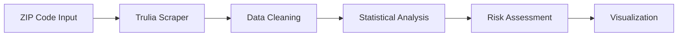

# 🏠 Property Damage Estimator
### *Trulia Data Analysis Tool for Disaster Impact Assessment*

[](https://python.org)
[](LICENSE)
[]()
[]()

> **🎯 Mission**: Rapidly assess property damage risk during disasters by analyzing real estate data across ZIP codes

---

## 🚀 Quick Start

```bash
# 1. Clone the repository
git clone https://github.com/your-repo/property-damage-estimator

# 2. Install dependencies  
pip install -r requirements.txt

# 3. Run the estimator
python estimator.py --zip "10001,10002,10003"
```

**⚡ In 30 seconds, get comprehensive housing statistics for any NYC ZIP code!**

---

## 🎯 What This Tool Does

<table>
<tr>
<td width="50%">

### 📊 **Input**
- ZIP codes (NYC focus)
- Disaster scenarios
- Risk parameters

</td>
<td width="50%">

### 📈 **Output**
- Property valuations
- Statistical summaries
- Damage estimates
- Risk assessments

</td>
</tr>
</table>

### 🏘️ **Key Metrics Analyzed**
| Metric | Description | Impact Score |
|--------|-------------|--------------|
| 💰 **Last Sale Price** | Recent transaction values | ⭐⭐⭐⭐⭐ |
| 🏡 **Property Details** | Beds, baths, sq footage | ⭐⭐⭐⭐ |
| 📊 **Market Statistics** | Mean, median, min/max | ⭐⭐⭐⭐⭐ |
| 🎯 **Risk Exposure** | Total value at risk | ⭐⭐⭐⭐⭐ |

---

## 🌟 Why This Matters

### 🌪️ **Hurricane Sandy Case Study**
Our research revealed surprising resilience in NYC real estate post-Sandy:

```
📈 Recovery Timeline:
├── Q3 2011: Pre-disaster baseline
├── Q4 2012: Hurricane Sandy impact  
├── Q2 2013: 80% recovery achieved
└── Q4 2013: Full market recovery
```

**Key Insights:**
- 🏗️ High-rises showed remarkable resilience
- 🏠 Low-rise residential areas most vulnerable  
- 💰 Insurance/FEMA support accelerated recovery
- 📍 Location matters more than property type

---

## 🛠️ Technical Architecture

### **Data Pipeline**


### **Core Components**

<details>
<summary>🔧 <strong>Data Collection Engine</strong></summary>

- **Web Scraper**: Trulia-optimized HTML parser
- **Validation**: ZIP code verification & deduplication
- **Pagination**: Handles large result sets automatically
- **Rate Limiting**: Respectful scraping practices

</details>

<details>
<summary>📊 <strong>Analysis Engine</strong></summary>

- **Statistical Computing**: Mean, median, min/max calculations
- **Data Cleaning**: Regex parsing, type conversion
- **Quality Assurance**: Missing data handling
- **Export Options**: CSV, JSON output formats

</details>

<details>
<summary>📈 <strong>Visualization Suite</strong></summary>

- **Summary Statistics**: Comprehensive ZIP code breakdowns
- **Comparative Analysis**: Multi-ZIP comparisons
- **Risk Heatmaps**: Visual damage assessment *(Coming Soon)*
- **Time Series**: Historical trend analysis *(Planned)*

</details>

---

## 📋 Dependencies

### **Core Libraries**
```python
requests       # Web scraping
BeautifulSoup  # HTML parsing  
pandas         # Data manipulation
numpy          # Statistical analysis
re             # Pattern matching
```

### **Optional Enhancements**
```python
matplotlib     # Basic visualizations
seaborn        # Advanced plotting
folium         # Geographic mapping
plotly         # Interactive charts
```

---

## 🎨 Usage Examples

### **Single ZIP Analysis**
```python
from estimator import PropertyAnalyzer

analyzer = PropertyAnalyzer()
results = analyzer.analyze_zip("10001")
print(f"Average home value: ${results['mean_price']:,.2f}")
```

### **Multi-ZIP Comparison**
```python
zip_codes = ["10001", "10002", "10003", "11224", "11225"]
comparison = analyzer.compare_zips(zip_codes)
comparison.to_csv("nyc_comparison.csv")
```

### **Risk Assessment**
```python
risk_report = analyzer.assess_damage_risk(
    zip_codes=["11224"],  # Hurricane-prone area
    scenario="Category 2 Hurricane",
    damage_percent=0.15
)
```

---

## 📊 Sample Output

```
🏠 ZIP Code Analysis Results
═══════════════════════════════════════

📍 ZIP: 10001 (Manhattan)
┌─────────────────┬──────────────┬──────────────┐
│ Metric          │ Value        │ Market Pos   │
├─────────────────┼──────────────┼──────────────┤
│ Avg Price       │ $1,250,000   │ 95th %ile    │
│ Properties      │ 156 units    │ High density │
│ Avg Sq Ft       │ 1,100 sq ft  │ Compact      │
│ Total Value     │ $195M        │ High risk    │
└─────────────────┴──────────────┴──────────────┘

💡 Risk Assessment: HIGH - Significant exposure due to high property values
```

---

## 🗺️ Roadmap

### **Phase 1: Foundation** ✅
- [x] Trulia scraper implementation
- [x] Basic statistical analysis
- [x] CSV export functionality
- [x] ZIP code validation

### **Phase 2: Enhancement** 🚧
- [ ] Interactive visualizations
- [ ] Real-time data updates  
- [ ] Advanced risk modeling
- [ ] Geographic mapping

### **Phase 3: Scale** 📋
- [ ] Historical trend analysis
- [ ] Census data integration
- [ ] Machine learning predictions
- [ ] API development

---

## 🤝 Contributing

We welcome contributions! Here's how to get involved:

### **Quick Contribution Guide**
1. 🍴 Fork the repository
2. 🌱 Create a feature branch (`git checkout -b feature/amazing-feature`)
3. 💾 Commit changes (`git commit -m 'Add amazing feature'`)
4. 📤 Push to branch (`git push origin feature/amazing-feature`)
5. 🔄 Open a Pull Request

### **Development Areas**
- 🐛 **Bug Fixes**: Help improve reliability
- 📊 **Visualizations**: Create compelling charts
- 🗺️ **Geographic Features**: Add mapping capabilities
- 📈 **Statistical Models**: Enhance risk assessment

---

### **Organizations**
- 🎓 **General Assembly** - Educational Partnership
- 🏢 **New Light Technologies** - Technical Collaboration

---

## 🙏 Acknowledgments

- **Trulia** for providing accessible real estate data
- **Hurricane Sandy survivors** who inspired this research
- **Open source community** for foundational tools
- **FEMA & insurance data** for validation insights

---

<div align="center">

### ⭐ **Star this repo if it helped you assess property risk!** ⭐

**[🚀 Get Started](#-quick-start) | [📊 View Examples](#-usage-examples) | [🤝 Contribute](#-contributing)**

*Built with ❤️ for disaster preparedness and community resilience*

</div>
